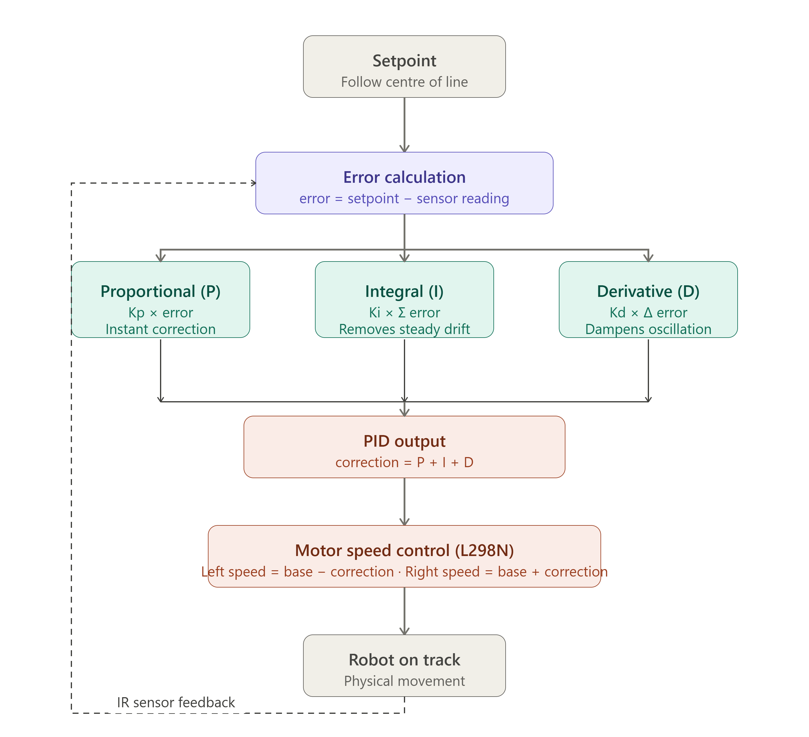

# 🤖 PID Line Following Robot

> Built as part of the Dynamac Robotics Club — Embedded Systems division.  
> Competed in university-level robotics competitions.

## 📋 Table of Contents

- [Overview](#overview)
- [How It Works](#how-it-works)
- [Components](#components)
- [Circuit Diagram](#circuit-diagram)
- [Pin Mapping](#pin-mapping)
- [PID Tuning](#pid-tuning)
- [Code Structure](#code-structure)
- [How to Upload & Run](#how-to-upload--run)
- [Related Project](#related-project)
- [Competition Context](#competition-context)
- [License](#license)

## Overview

A 2-wheeled differential drive robot that follows a black line on a white surface using 2 IR sensors and a PID control algorithm. Built with Arduino UNO and an L298N motor driver.

This robot uses differential steering where two independently controlled motors adjust their speeds based on sensor feedback to keep the robot centered on the line. The PID control algorithm ensures smooth, accurate tracking with minimal oscillation.

## How It Works

The robot uses a **2-IR sensor differential drive system**:

1. **Two IR sensors** (left and right) are positioned at the front of the robot to detect the black line against a white background
2. Each sensor outputs a digital signal: LOW when detecting the black line, HIGH when detecting white surface
3. The **PID controller** calculates a correction value based on the error (deviation from the line)
4. This correction adjusts the **differential speed** of the left and right motors via PWM signals
5. The **L298N motor driver** receives direction and speed commands to control both DC motors independently

**Logic:**
- **Both sensors on line** → Robot goes straight at base speed
- **Left sensor off line** → Robot turns left by reducing left motor speed
- **Right sensor off line** → Robot turns right by reducing right motor speed
- **Both sensors off line** → Robot applies the last known correction to recover the line

The PID algorithm continuously refines the correction to minimize error and prevent overshooting.

### Control Flow Diagram

The diagram above illustrates the complete control flow from sensor reading through PID calculation to motor control.

## Components

| Component | Quantity | Purpose |
|---|---|---|
| Arduino UNO | 1 | Main microcontroller |
| L298N Motor Driver | 1 | Motor speed & direction control |
| DC Motor (Yellow) | 2 | Drive wheels (left & right) |
| IR Sensor Module | 2 | Left & right line detection |
| Breadboard | 1 | Wire distribution |
| 9V Battery | 1 | Power supply |
| Jumper Wires | — | Component connections |

See [docs/components.md](docs/components.md) for detailed component information.

## Circuit Diagram

The circuit shows the complete wiring between the Arduino UNO, L298N motor driver, IR sensors, and DC motors. The L298N is powered by a 9V battery and provides 5V output to power the Arduino.

See [docs/circuit-diagram.md](docs/circuit-diagram.md) for detailed wiring instructions.

## Pin Mapping

| Component Pin | Arduino Pin | Notes |
|---|---|---|
| IR Sensor LEFT OUT | D2 | Digital input |
| IR Sensor RIGHT OUT | D3 | Digital input |
| IR Sensors VCC | 5V | — |
| IR Sensors GND | GND | — |
| L298N IN1 | D4 | Left motor direction |
| L298N IN2 | D5 | Left motor direction |
| L298N IN3 | D6 | Right motor direction |
| L298N IN4 | D7 | Right motor direction |
| L298N ENA | D9 | Left motor PWM speed |
| L298N ENB | D10 | Right motor PWM speed |
| L298N 12V | Battery + | 9V power in |
| L298N GND | GND | Common ground |
| L298N 5V out | Arduino VIN | Powers Arduino |

## PID Tuning

| Constant | Default | Effect |
|---|---|---|
| Kp | 2.0 | Proportional — how hard it corrects |
| Ki | 0.0 | Integral — eliminates steady-state error |
| Kd | 1.0 | Derivative — dampens oscillation |

**Tuning Tips:**
- Start with Kp only, set Ki and Kd to 0
- Increase Kp until the robot follows the line with small oscillations
- Add Kd to reduce oscillations and smooth the path
- Add Ki only if the robot consistently drifts to one side (usually not needed for this simple 2-sensor setup)

See [docs/pid-explained.md](docs/pid-explained.md) for a detailed explanation of PID control.

## Code Structure

The main Arduino sketch `src/line_follower/line_follower.ino` is organized as follows:

1. **Pin Definitions** — Maps Arduino pins to sensors and motor driver
2. **PID Constants** — Kp, Ki, Kd tuning parameters at the top for easy adjustment
3. **Global Variables** — PID calculation variables (error, lastError, integral)
4. **setup()** — Initializes pins, serial communication, and sets initial motor states
5. **loop()** — Main control loop:
   - Reads sensor values
   - Calculates error based on sensor states
   - Computes PID correction
   - Applies correction to motor speeds
   - Outputs debug information to Serial Monitor
6. **Motor Control Functions** — Helper functions to set motor speeds and directions

The code includes extensive comments explaining the logic and Serial debug output for monitoring sensor states and PID values in real-time.

## How to Upload & Run

1. **Install Arduino IDE** — Download from [arduino.cc](https://www.arduino.cc/en/software)
2. **Open the sketch** — Navigate to `src/line_follower/line_follower.ino`
3. **Select Board** — Tools → Board → Arduino UNO
4. **Select Port** — Tools → Port → (select your Arduino's COM port)
5. **Upload** — Click the Upload button (→)
6. **Place robot** on a black line on a white surface
7. **Power on** the 9V battery
8. **Open Serial Monitor** (Tools → Serial Monitor) at 9600 baud to view debug output

**Track Setup:**
- Use black electrical tape on a white surface
- Line width: 2-3 cm
- Ensure good contrast between line and background
- Start with gentle curves before attempting sharp turns

## Related Project

🔗 **Also built:** [Bluetooth Remote-Controlled Rover](https://github.com/trabelssi/bluetooth-rover-robot)

A companion project that uses an HC-05 Bluetooth module for wireless smartphone control. Both projects were developed and competed together in university robotics competitions.

**Key Differences:**
- **Line Follower:** Autonomous navigation with PID algorithm and IR sensors
- **Bluetooth Rover:** Manual remote control via smartphone

Both projects demonstrate different aspects of robotics: autonomous control with sensor fusion vs. wireless communication & manual control.

## Competition Context

This robot was built and competed as a member of **Dynamac Robotics Club** (Embedded Systems division) in university-level robotics competitions. The club focuses on practical robotics projects including autonomous navigation and remote-controlled systems.

The line follower competed alongside our [Bluetooth-controlled rover](https://github.com/trabelssi/bluetooth-rover-robot), demonstrating different aspects of embedded systems design and control algorithms.

## License

MIT License — see [LICENSE](LICENSE).

---

**Built with ❤️ by the Dynamac Robotics Club**
