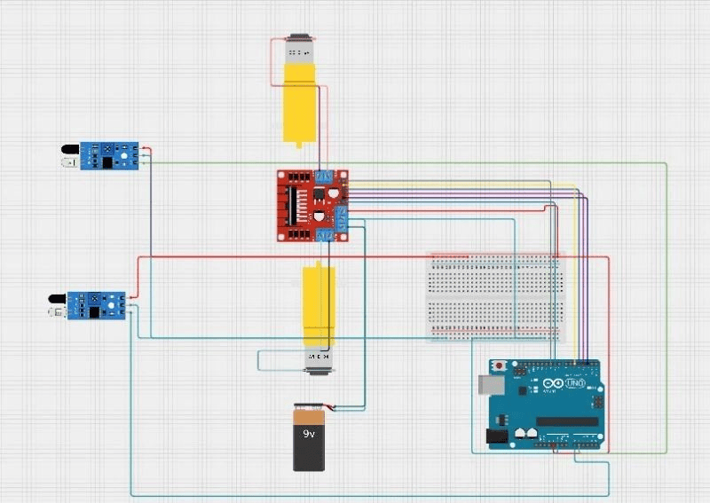

# Circuit Diagram

This document explains the wiring and connections for the PID Line Following Robot.

## Complete Circuit

The schematic above shows all connections between the Arduino UNO, L298N motor driver, IR sensors, DC motors, and power supply.

---

## Pin Mapping Table

| Component Pin | Arduino Pin | Notes |
|---|---|---|
| IR Sensor LEFT OUT | D2 | Digital input |
| IR Sensor RIGHT OUT | D3 | Digital input |
| IR Sensors VCC | 5V | — |
| IR Sensors GND | GND | — |
| L298N IN1 | D4 | Left motor direction |
| L298N IN2 | D5 | Left motor direction |
| L298N IN3 | D6 | Right motor direction |
| L298N IN4 | D7 | Right motor direction |
| L298N ENA | D9 | Left motor PWM speed |
| L298N ENB | D10 | Right motor PWM speed |
| L298N 12V | Battery + | 9V power in |
| L298N GND | GND | Common ground |
| L298N 5V out | Arduino VIN | Powers Arduino |

---

## Wiring Logic Explained

### Power Distribution

The robot uses a **single 9V battery** to power everything:

1. **Battery → L298N 12V input:** The 9V battery connects directly to the L298N's 12V input terminal
2. **L298N 5V output → Arduino VIN:** The L298N has a built-in voltage regulator that outputs 5V, which powers the Arduino
3. **Arduino 5V → IR Sensors:** The Arduino distributes regulated 5V to both IR sensor modules via the breadboard
4. **Common Ground:** All components share a common ground connection through the breadboard

This configuration eliminates the need for multiple batteries or external voltage regulators.

### Sensor Connections

Both IR sensor modules connect identically to the Arduino:

- **VCC → 5V** (via breadboard power rail)
- **GND → GND** (via breadboard ground rail)
- **OUT → Digital Pin** (D2 for left, D3 for right)

The IR sensors output a **digital signal**:
- **LOW (0):** Black line detected
- **HIGH (1):** White surface detected

### Motor Driver Connections

The L298N motor driver uses 6 control pins from the Arduino:

**Direction Control (Digital Pins):**
- **IN1 & IN2:** Control left motor direction
  - IN1=HIGH, IN2=LOW → Forward
  - IN1=LOW, IN2=HIGH → Reverse
- **IN3 & IN4:** Control right motor direction
  - IN3=HIGH, IN4=LOW → Forward
  - IN3=LOW, IN4=HIGH → Reverse

**Speed Control (PWM Pins):**
- **ENA (D9):** Controls left motor speed using PWM (0-255)
- **ENB (D10):** Controls right motor speed using PWM (0-255)

**Motor Outputs:**
- **OUT1 & OUT2:** Connect to left DC motor
- **OUT3 & OUT4:** Connect to right DC motor

The beauty of the L298N is that it amplifies the Arduino's low-current control signals (5V, ~40mA) into high-current motor control (9V, up to 2A per motor), allowing precise speed and direction control.

---

## Assembly Steps

1. **Mount components on chassis:** Secure Arduino, breadboard, L298N, and battery holder
2. **Connect motors to L298N:** Wire left motor to OUT1/OUT2, right motor to OUT3/OUT4
3. **Wire power system:**
   - Battery + → L298N 12V
   - Battery - → L298N GND
   - L298N 5V out → Arduino VIN
   - L298N GND → Arduino GND
4. **Connect motor control signals:**
   - Arduino D4 → L298N IN1
   - Arduino D5 → L298N IN2
   - Arduino D6 → L298N IN3
   - Arduino D7 → L298N IN4
   - Arduino D9 → L298N ENA
   - Arduino D10 → L298N ENB
5. **Set up breadboard power rails:**
   - Arduino 5V → Breadboard + rail
   - Arduino GND → Breadboard - rail
6. **Connect IR sensors:**
   - Both sensors VCC → Breadboard + rail
   - Both sensors GND → Breadboard - rail
   - Left sensor OUT → Arduino D2
   - Right sensor OUT → Arduino D3
7. **Position sensors:** Mount IR sensors at the front, about 1-2cm above ground, spaced to straddle the line

---

## Important Notes

### L298N Jumper Configuration

The L298N module has jumpers for ENA and ENB:
- **Jumpers ON:** Motors run at full speed, PWM control disabled
- **Jumpers OFF:** PWM control enabled (required for this project)

**Make sure the ENA and ENB jumpers are REMOVED** to enable speed control.

### Sensor Positioning

- Position sensors **1-2cm above the ground** for optimal detection
- Space sensors so they **straddle the line** when the robot is centered
- Adjust the **potentiometers on each IR sensor** so they reliably detect the line in your specific lighting conditions

### Common Ground

All grounds must be connected together:
- Battery ground
- Arduino ground
- L298N ground
- Breadboard ground rail

This ensures stable operation and prevents signal interference.

### Safety

- **Do not short circuit** the battery terminals
- Use a **battery holder with a switch** for easy on/off control
- **Disconnect battery** when uploading code to Arduino via USB

---

## Testing Connections

Before running the full program:

1. **Test sensors:** Use Serial Monitor to verify sensor readings respond to black/white surfaces
2. **Test motors individually:** Write a simple sketch to run each motor forward, then reverse
3. **Verify PWM control:** Gradually increase speed from 0 to 255 to ensure smooth speed control
4. **Check direction:** Confirm motors spin in the correct direction for forward motion

Once all components are verified individually, upload the full line follower code.
